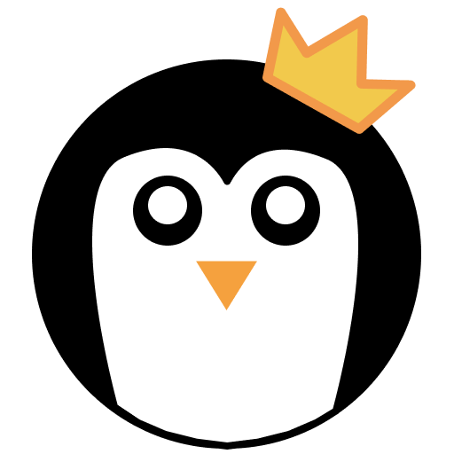

<h1 align="center">
   
    
   Cooped Up
</h1>
<h4 align="center">A web-based version of the popular board game <a href="http://indieboardsandcards.com/index.php/our-games/coup/">Coup</a>.</h4>
 

## Project Architecture

Frontend Framework: [React](https://reactjs.org/)

UI Library: [Chakra UI](https://github.com/chakra-ui/chakra-ui)

Build tool: [Snowpack](https://github.com/snowpackjs/snowpack)

Project managed on [Trello](https://trello.com/b/wQ1blugM/cooped-up)

## Running the Code

1. Clone the repo using `https://github.com/mattwells19/Cooped-Up.git`
2. Verify Node is installed by typing `node -v` in your console/terminal.
   1. If Node is not installed then install it [here](https://nodejs.org/en/download/).
   2. Make sure to include NPM (Node Package Manager) when installing.
3. Install `yarn` using `npm i -g yarn`
   1. `yarn` is a popular package manager that enables the use of shared dependencies for multi-project repos such as this one.
4. Install dependencies with `yarn` by typing `yarn install`
5. Start the app by running `yarn start`.
   - If you are using VS Code then there is already a `launch.json` file that will run debugging for both projects. Simply go to the debugging tab, select `Start Project` and click Run.
